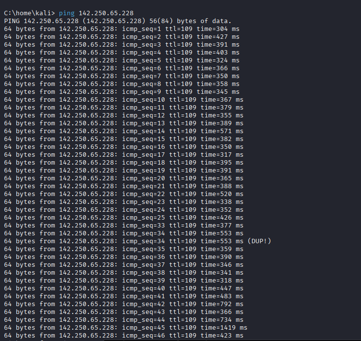

# Ex-02 InformationGathering
Information Gathering Techiques

# To perform information gathering techniques

# AIM:

To perform information gathering techniques using kali linux 

## STEPS:

### Step 1:

Install kali linux either in partition or virtual box or in live mode

### Step 2:

Investigate on the various categories of tools as follows:

### Step 3:
Open terminal/browser and try execute necessary commands/use url to perform information gathering

## Architecture Diagram
```
                      +-------------------------+
                      |     Attacker System     |
                      |     (Kali Linux)        |
                      +-----------+-------------+
                                  |
                                  | Terminal / Browser
                                  | Executes Recon Tools
                                  v
      +------------------- Passive Recon --------------------+
      |                                                     |
      |  +----------------+     +------------------------+  |
      |  |   WHOIS Query  | --> |    Domain Registrars    |  |
      |  +----------------+     +------------------------+  |
      |                                                     |
      |  +----------------+     +------------------------+  |
      |  |   DNS Enum     | --> |     Public DNS Servers  |  |
      |  +----------------+     +------------------------+  |
      |                                                     |
      +-----------------------------------------------------+

                                  |
                                  v

      +------------------ Active Recon ----------------------+
      |                                                     |
      |  +----------------+     +------------------------+  |
      |  |   Nmap Scan    | --> |  Target Host/Network    |  |
      |  +----------------+     +------------------------+  |
      |                                                     |
      |  +----------------+     +------------------------+  |
      |  | WhatWeb, Wapp | --> |   Target Web Application |  |
      |  +----------------+     +------------------------+  |
      |                                                     |
      |  +----------------+     +------------------------+  |
      |  | theHarvester   | --> |     Search Engines      |  |
      |  +----------------+     +------------------------+  |
      +-----------------------------------------------------+

                                  |
                                  v
                    +-----------------------------+
                    |     Collected Information   |
                    | - IPs, Subdomains           |
                    | - Open Ports & Services     |
                    | - Technology Stack          |
                    | - Emails, Metadata          |
                    +-----------------------------+
```

## OUTPUT:
### Whois


### Finding Hosting Company :


### History of the website :


### ping command :



### whois :


### netcat :


### nmap :


### whatweb :


### httprint :


### TCP traceroute :


### UDP traceroute :


## RESULT:
The information gathering techniques tools/procedure were  identified successfully
